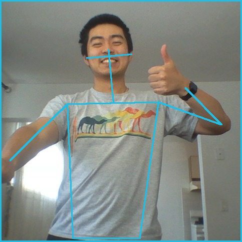

# Japanese Game Show Game

For the 2020 McGill AI Society (MAIS) Hackathon, we ([Alex](https://github.com/allu5662), [Micaela](https://github.com/mgraiver), [Ronan](https://github.com/RonanAlmeida), and [Ruitai](https://github.com/ruitaiS)) decided to make a virtual version of this [Japanese Game Show](https://youtu.be/6ioiMXKpHxI)

## Dependencies:
<!--details on what packages to install to get it running -->
```
npm install react
npm install draw-shape-reactjs
npm install react-webcam

```

## Implementation Details:

### Tech Stack:
We used React on the front-end, and Flask for the back-end. Posture recognition was provided by the [WRNCH](https://wrnch.ai/) computer vision API.

<!-- TODO: List the libraries used -->

### Image Capture and API Request:
The React-Camera component takes a picture via the user's webcam, and sends it to the Flask server via a POST request as a Base64 byte string. Flask then decodes the byte string back into an image, storing it locally before uploading it to WRNCH's servers for processing. 

### JSON Parsing and Displaying to Screen:

After processing, WRNCH returns a JSON string containing an array of coordinates corresponding to different joints on the body. For indexes i = 0 to 25, the ith position contained the x coordinate while the i + 1 position contained the y coordinate.

<p align="center">
  
</p>
 The coordinates were unit normalized, meaning that they ranged in value from 0-1. This allowed us easily scale the image by multiplying the coordinates by a set constant (we went with 500).

<p align="center">
    
</p>
In addition, not all joints were connected. Using the above reference provided by the API documentation, we hard coded the indices of connected joints into an array. By iterating over this array, we were able to then draw line segments between connected joints and display the skeletal figure to the screen.

### Collision Detection:
Both the figure and the silhouette shape consist of line segments, so collision detection was a simple matter of solving for the intersection of two lines. There were however two caveats:

First, the coordinate systems for the webpage and the JSON data have the positive Y direction facing down, but equations for the slope of a line assume that Y is positive in the upward direction. To overcome this, we inverted the Y values of each endpoint prior to calculating the intersection, and again prior to displaying them. The initial inversion mapped the coordinates onto the fourth quadrant of the standard Cartesian plane, with the origin at the top-left corner of the screen; the second inversion mapped them back to the on-screen coordinate system.

Second, *any* two non-parallel lines will eventually intersect, so we needed to set a boundary within which an intersection must occur. Initially we set the bounding box to be the smallest box which contained both line segments, but this proved to be insufficient as we continued to get false positives. 

<!-- Image describing the false collisions -->

The solution which we found worked in the end was to sort the x (or y) values of the four points, then take the inner two as the maximum and minimum x (or y) bounds. A simple proof for this is as follows: Say we project both line segments onto the X axis by keeping the x values but setting the y values of each point to 0. The point of intersection between the two segments, if it exists, has to exist in the area of overlap between the two projections. The x values of the overlapping area would be the innermost two x values after sorting.

<!-- Diagram for the proof -->
<!-- Also maybe write it better -->

### Concusion / Further Exploration:

<p align="center"></p>
